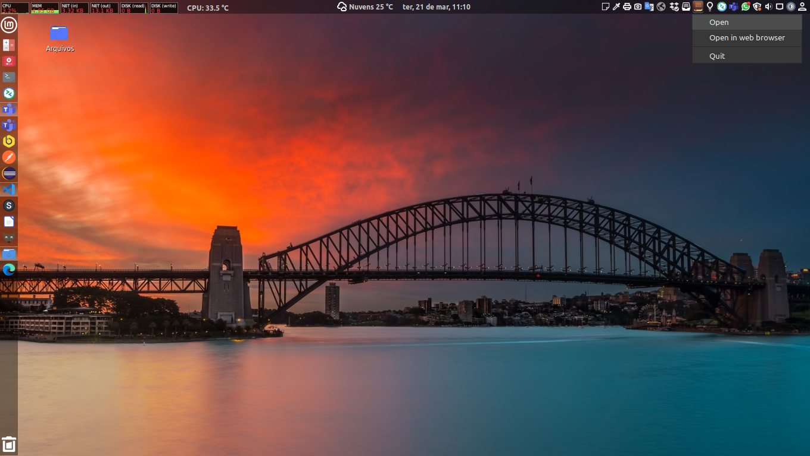
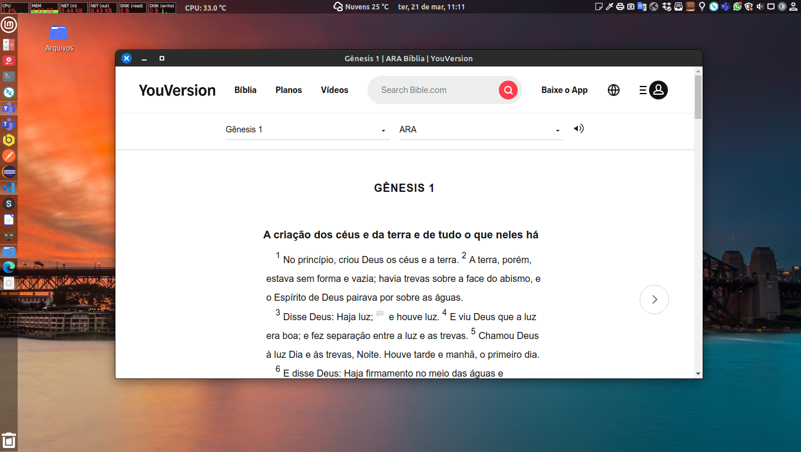
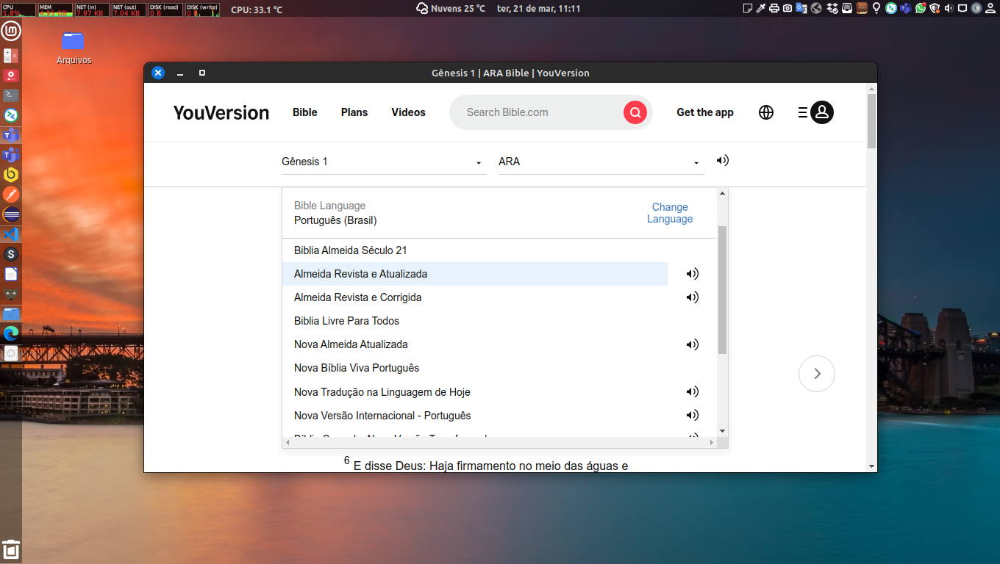

# YouVersion-Desktop








## Description

The YouVersion-Desktop is a Electron desktop client for YouVersion Holy Bible.

**Attention!**
This application was initially developed for Linux and Windows environments, if you want to run it in other environments make sure that all dependencies are satisfied.


## Installation

1. To compile and install the application, first of all, clone the project or download the zipped source code to your local machine.

2. Access the project folder and run the command to download the dependencies:
```
$ npm install
```

3. run the command to build the application.
```
$ npm run build:linux
```
For Linux environments or
```
$ npm run build:win
```
For Windows environments

4. Access the `build/youversion-desktop-*-x64/installers/` in project and install the generated youversion-desktop_VERSION_amd64.deb ou youversion-desktop_VERSION_amd64.exe packages.

With that the application will be working. Now you can translate your texts locally.


## Contributors

[Luciano Brito](https://github.com/lucianobritodev)

Brazilian, married, born in 1991, passionate about technology. Graduated in Systems Analysis and Development from Paulist University (UNIP) in 2019 and Post Graduate in Software Architecture from Infnet Institute in 2023.


## Contacts

- [LinkeIn](https://www.linkedin.com/in/luciano-brito-dev)
- [Gmail](mailto:lucianobrito.dev@gmail.com)
- [Instagram](https://www.instagram.com/lucianobrito.dev)


## Donates

[](https://www.paypal.com/donate/?hosted_button_id=SX3L4N89M8ZRW)